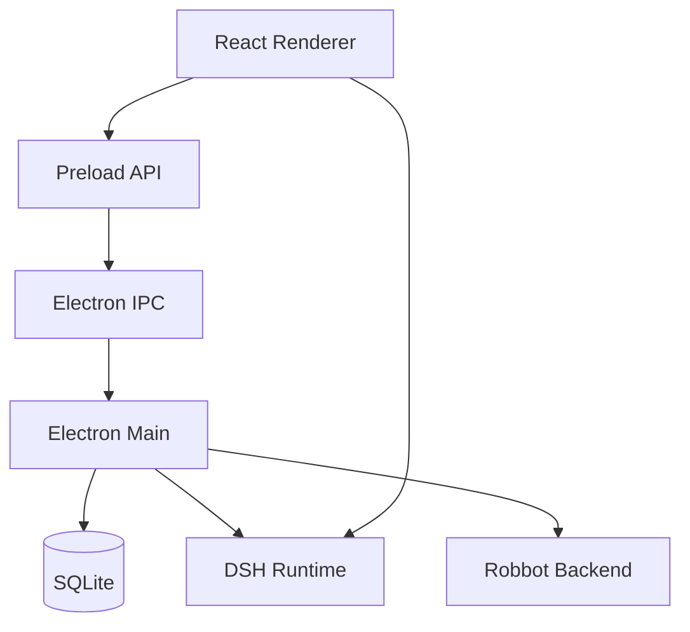

# robbot

> 基于 DeepSeek Harness 的桌面 Agent 客户端。

[](https://github.com/huiruo/robbot/actions/workflows/ci.yml)

Robbot 有自己的账号体系、SQLite 本地存储、AI 配置、插件依赖与启用管理、DSH_HOME 隔离、Electron partition 隔离、Main/Renderer IPC、安全 preload、窗口生命周期和发布流程。DSH Web UI 是 Agent 能力与插件能力的宿主，Robbot 负责产品层、插件 runtime 编排和桌面端工程层。

## 下载安装

当前正式安装包支持 Windows x64 和 macOS arm64。无需额外环境，下载安装后一键使用。

| 平台 | 下载 | 安装方式 |
| --- | --- | --- |
| Windows x64 | [下载 exe](https://github.com/robbot-labs/robbot/releases/download/v1.0.0/Robbot-windows-x64.zip) | 解压后安装 Robbot |
| macOS arm64 | [下载 ZIP](https://github.com/robbot-labs/robbot/releases/download/v1.0.0/Robbot-darwin-arm64-1.0.1.zip) | 解压后安装 Robbot


## 架构



核心边界：

- Robbot：认证、账号配置、桌面窗口、IPC、打包发布
- DSH：会话、工具、审批、上下文、Web UI
- Backend：账号服务、桌面版本服务

## 插件架构

Robbot 启动的是完整 DeepSeek Harness runtime，因此插件优先走标准
DSH/Cordis 机制：能原生加载的 DSH 插件直接复用；需要 Robbot 账号、权限、
本地存储或桌面能力时，通过 Robbot adapter 接入；只有无法复用 DSH 插件模型时，
才实现 Robbot 原生插件。

插件可以扩展 DSH 的工具、Web UI 和运行时能力。Robbot 负责把插件依赖、启用状态、
账号级 DSH_HOME profile 和打包后的 Electron runtime 串成同一条工程链路。


插件链路由两份配置协同管理：

- `runtime-plugins/package.json`：声明和安装插件依赖
- `runtime-plugins/manifest.json`：控制插件是否启用，并保留来源等展示元数据

这套机制遵循 DSH/Cordis 标准：Robbot 不修改 DSH vendor，也不依赖插件专用环境变量。
启用的插件会写入 DSH Web profile bundles，并进入本地多账号 profile 同步；同一套
runtime-plugins 配置同时服务于开发环境和打包后的 Electron runtime，让插件从接入、
启用到发布保持一致。

安装并启用插件后，常用命令如下：

```bash
pnpm --dir runtime-plugins add <plugin>
pnpm dsh:plugin:sync-profiles
pnpm dsh:plugin:verify
pnpm dev
```

Robbot 可逐级验证插件链路：模块解析、插件加载、profile 注册和打包运行可自动检查；
实际工具调用在 DSH 会话中完成执行级验证。

## 功能
- DSH Web UI 集成
- DSH/Cordis 插件加载与多账号 profile 同步
- 本地数据持久化
- Windows / macOS 打包
- 多账号、桌面端版本管理

## 快速开始

前置要求：

- Node.js >= 22
- pnpm 10
- Git submodule

```bash
git submodule update --init --recursive
pnpm install
pnpm dsh:setup
pnpm dev
```

## 常用命令

| 命令 | 说明 |
|---|---|
| `pnpm dev` | 启动桌面应用 |
| `pnpm build` | 构建 workspace |
| `pnpm test:dsh` | 运行 DSH 契约测试 |
| `pnpm dsh:setup` | 安装并构建 DSH runtime |
| `pnpm dsh:build` | 构建已有 DSH runtime |
| `pnpm dsh:update` | 更新 DSH submodule |
| `pnpm dsh:info` | 查看 DSH runtime 信息 |

## Desktop

入口目录：

```bash
cd apps/desktop
```

| 命令 | 说明 |
|---|---|
| `npm run package` | 生成展开后的 Electron app |
| `npm run make:mac` | 生成 macOS arm64 发布包 |
| `npm run make:win` | 生成 Windows Squirrel 安装包 |
| `npm run make:win:nsis` | 生成 Windows NSIS 安装包 |

## 项目结构

```text
robbot/
├── apps/
│   └── desktop/
│       ├── electron/       # Electron main / preload / storage / IPC
│       └── renderer/       # React renderer
├── packages/
│   ├── core/
│   ├── dsh-adapter/
│   └── skill-coding/
├── tests/
│   └── dsh-contract/
├── runtime-plugins/        # Robbot 管理的 DSH/Cordis 插件依赖和启用清单
├── scripts/
├── config/
└── vendor/
    ├── deepseek-harness/   # DSH runtime vendor
    └── dsh-*/              # 本地 DSH 插件源码 / 验证插件
```

## License

Private project. All rights reserved.
